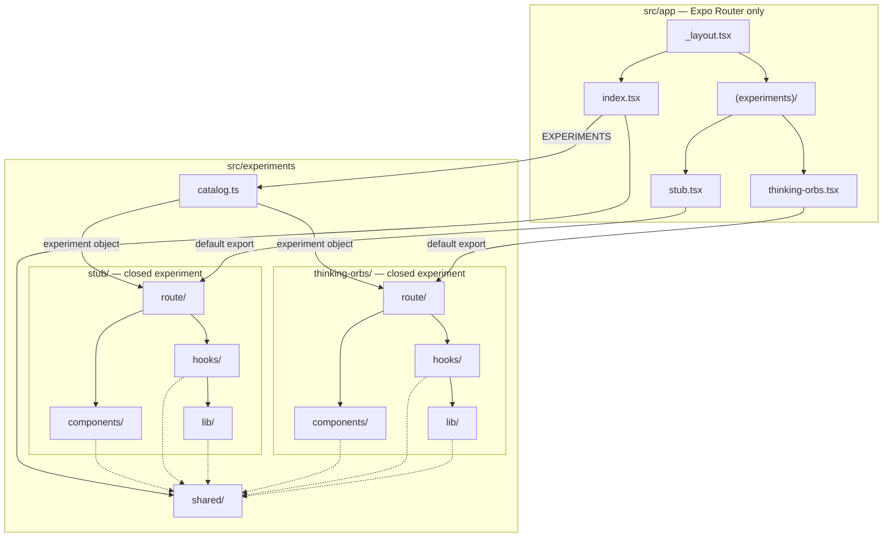

# react-native-experiments

A showcase app for small React Native / Expo UI experiments — a feed of cards, each rendering its component **live** inside a phone mockup.

## Architecture

The host app is only routing and the home feed. Every experiment is a closed package: it owns its screens, components, hooks, and lib. Experiments never import each other.



Solid arrows are required wiring. Dashed arrows are allowed imports into `shared/`. An experiment must not import another experiment.

```
src/
  app/                              # Expo Router only
    _layout.tsx                     #   stack: feed + experiment screens
    index.tsx                       #   home feed
    (experiments)/                  #   one re-export per experiment
      stub.tsx
      thinking-orbs.tsx
  experiments/
    catalog.ts                      # ordered list for the feed
    shared/                         # cards, theme, hooks used by many experiments
      components/
      constants/
      contexts/
      hooks/
      lib/
    stub/                           # template experiment
      components/
      hooks/
      lib/
      route/                        # screens + the `experiment` object
    thinking-orbs/                  # Skia particle orbs + toast→sheet morph
  global.css
```

Expo Router only discovers files under `src/app/`. Each file in `(experiments)/` is a one-line re-export of that experiment's `route/` screen. The group name does not appear in the URL: `stub.tsx` is `/stub`.

This follows the same split as [rn-makeitanimated](https://github.com/make-it-animated/rn-makeitanimated) (`app/` re-exports, implementation under `src/`), without grouping experiments by app or alphabet.

### Adding an experiment

1. Create `src/experiments/<slug>/{components,hooks,lib,route}`.
2. Export the screen as `default` and an `experiment` object from `route/index.tsx` (href, brand, title, icon, preview).
3. Add `src/app/(experiments)/<slug>.tsx`: `export { default } from '@/experiments/<slug>/route'`.
4. Prepend the experiment to `EXPERIMENTS` in `src/experiments/catalog.ts`.

The feed picks it up; the new file is the typed route.

An experiment may import `@/experiments/shared/*` and its own folders. It must not import another experiment.

## Experiments

### Stub

The template. A closed experiment with `components/`, `hooks/`, `lib/`, and `route/`.

### Thinking orbs

Live Skia particle orbs (nine states) and a bottom-docked toast stack that morphs into a sheet. Engine vendored from [Jakub Antalik's thinking-orbs](https://github.com/Jakubantalik/thinking-orbs).

## Run

```bash
bun install
bunx expo start            # press i / a, or scan
bunx expo run:ios          # native dev-client build
bunx expo export --platform web   # RN Web build (headless preview)
```

## Stack

Expo SDK 57 · Expo Router · React Native 0.86 · Reanimated 4 · react-native-svg · TypeScript · bun.
